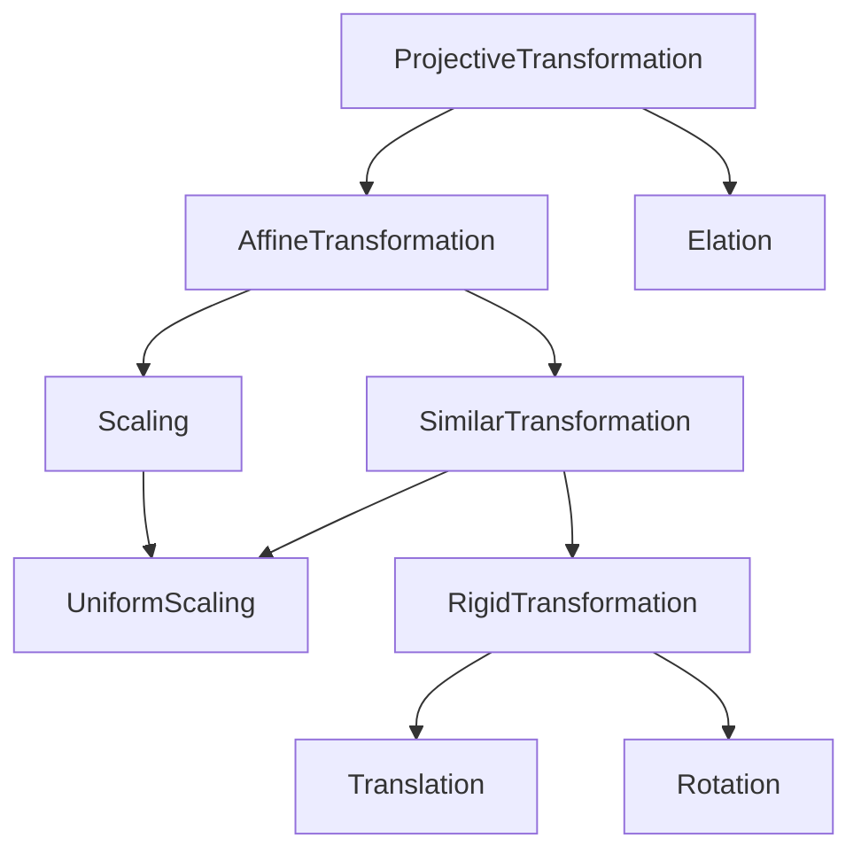

# Geometric transformations

Ochra provides a type hierarchy of geometric transformations. The hierarchy is as follows:

```mermaid
graph TD;
    ProjectiveTransformation-->AffineTransformation;
    ProjectiveTransformation-->Elation;
    AffineTransformation-->SimilarTransformation;
    AffineTransformation-->Scaling;
    SimilarTransformation-->UniformScaling;
    Scaling-->UniformScaling;
    SimilarTransformation-->RigidTransformation;
    RigidTransformation-->Translation;
    RigidTransformation-->Rotation;
```